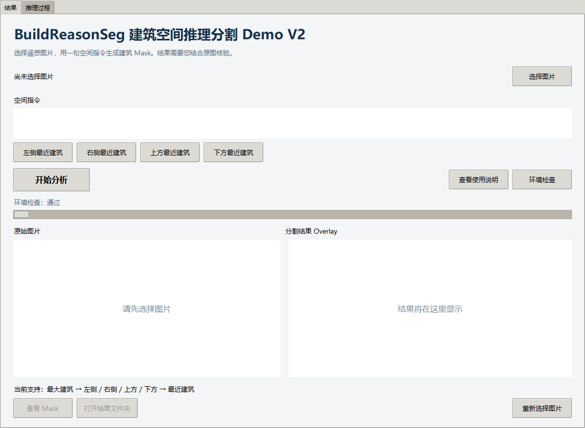
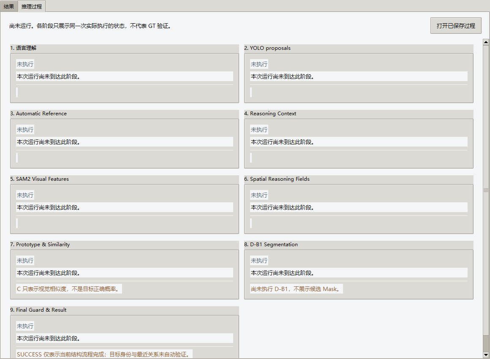
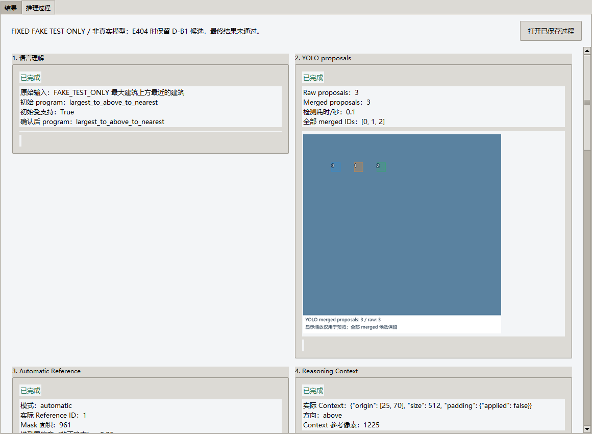
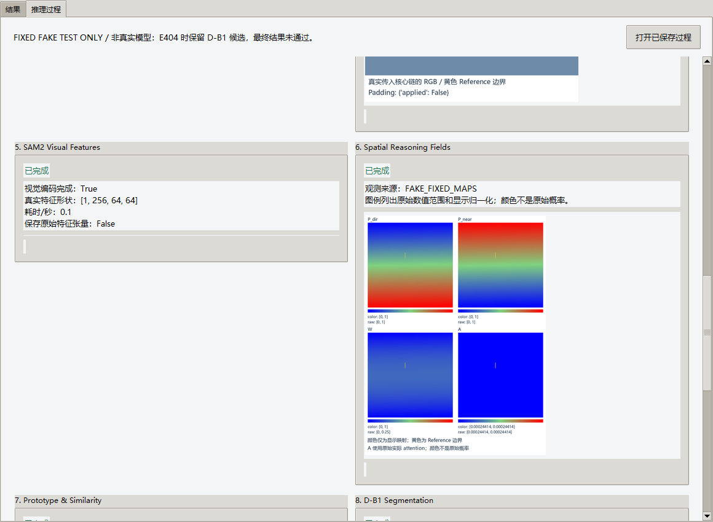
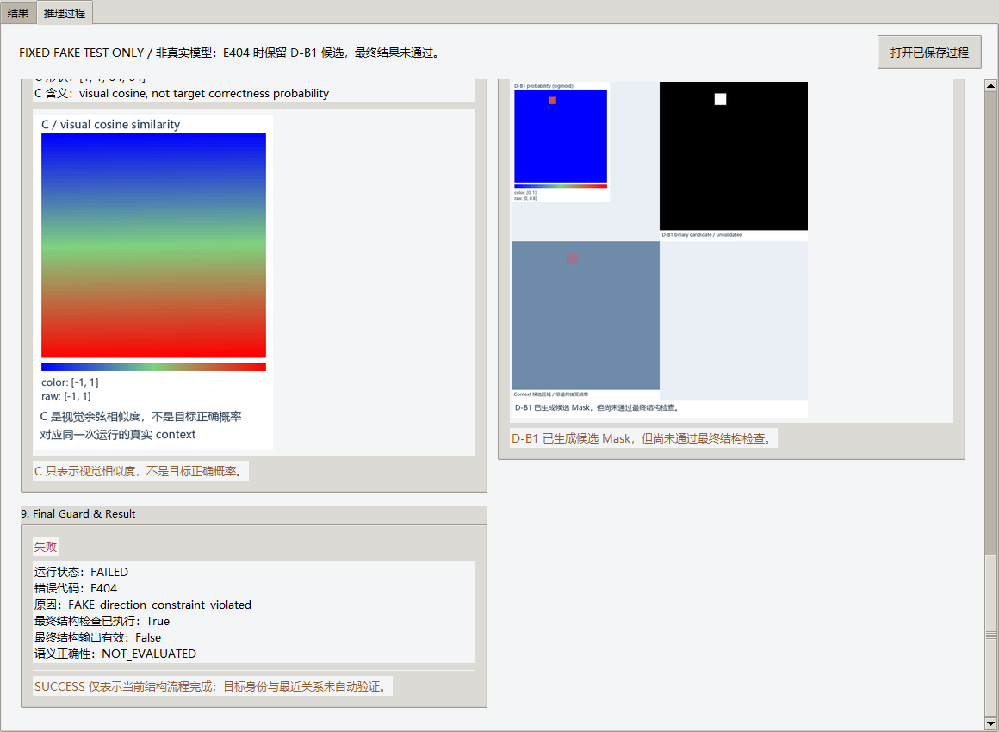

# Task8F 用户 Demo V2：实时推理过程交付报告

Status: READY_FOR_SUPERVISOR_AUDIT

Next gate: CHATGPT_TASK8F_USER_DEMO_LIVE_TRACE_AUDIT

最终交付：`C:\D\DeepSeekHarness\delivery\BuildReasonSeg_Demo_V2`。双击“启动BuildReasonSeg Demo.bat”，使用“结果 | 推理过程”两个平级页面。已实现真实科学阶段的只读事件 Hook、后台轻量渲染、主线程逐阶段显示；切页共用同一个 Worker、同一次 inference 和结果。真实模型 smoke 本次未执行；实际用户指令确认、GPU 等待与实时体验仍需人工验收。

本报告是 Executor 自检证据，最终验收属于 Supervisor。fake PASS、runtime SUCCESS 均不是语义正确性或 GT 独立证明。

## 验证与交付大小

| 门禁 | 结果 |
| --- | --- |
| 当前 dedicated fake tests | 56 passed / exit0 / 12.58s；Tk unraisable warning 作为错误 |
| 原 V1 tests，测试字节不变且独立进程 | 57 passed / exit0 / 3.06s |
| Git-canonical external helper，只读 | checked135 / match135 / missing0 / mismatch0 |
| V2 staging 与迁移后正式包 full hashes | 84/84，accepted model assets16项 hash一致 |
| 原生环境、两页窗口、主线程切页 | PASS；模型加载/推理0 |
| Windows PowerShell5.1 启动器 | BOM、parser、实际环境probe、正确quoted app/working directory/Hidden参数PASS；末尾进程分派拦截 |
| 无测试专用 Tcl/Tk locator 启动 | 真实 Tk 默认路径和GUI READY PASS |
| 模型资产迁移定位 | detector/SAM2/D-B1/Qwen/ProgramHead均定位正式V2 _engine |
| 历史保护 | RC12184文件、V1295文件、锁定repo175文件未变 |
| forbidden content/reparse | 0 offenders / 0 links |

Immutable manifest合计 **4,716,520,731 bytes（4.3926 GiB）/84 files**。实际磁盘86 files /4,716,560,212 bytes，包括manifest自身和一个新私有Ultralytics配置。包不含Python环境；只承诺已配置电脑整体文件夹迁移。`_ui/runtime.json` 的absolute Python字段是机器环境locator，科学源、模型与输出根目录均从当前Demo文件夹解析。

构建使用 `scripts/build_task8f_user_demo.py --assemble` 在不存在的 sibling staging 中独占创建文件、复制校验accepted资产并写manifest；静态/完整性/原生页面通过后 `--finalize` 一次整体移动到原本不存在的正式V2。没有手工拼包、覆盖已有目录、再次复制模型或删除历史数据。重新构建需要新的不存在目标；默认命令对已有正式/staging目录直接拒绝。

## 页面、阶段与存储

结果页保留图片选择、输入指令、四个仅填文字的快捷示例、Qwen/Validator/suggestion确认、开始分析、原图/Overlay、查看Mask、打开结果文件夹和重新选图。运行中禁止重复启动，允许切换两个页面。

过程页两列九卡片可滚动，各阶段按真实计算完成推送：

1. 原指令、初始program/支持与nearest状态、真实suggestion、确认与最终program；置信度不是正确率。
2. YOLO实际merged全部Mask/ID、raw/merged counts与检测耗时；不筛掉错误候选。
3. 实际automatic Reference，黄色边界、selected ID/area/confidence/bbox；无手动override。
4. 实际context origin/size/padding与真正传入的context RGB/reference Mask，不重新裁剪猜测。
5. 实际SAM2特征形状/编码完成/耗时；不保存原始大特征、不虚构热力图。
6. 实际P_dir/P_near/W/A四宫格；原始范围、颜色范围、显示归一化及Reference边界。
7. q实际维度/形成状态与C余弦相似度图；不是目标正确概率。
8. 实际D-B1 probability、candidate binary Mask、context overlay；明确“D-B1 已生成候选 Mask，但尚未通过最终结构检查。”
9. 实际最终guard及SUCCESS/E401/E402/E404/E502、输出有效性/耗时；成功输出仅结构有效，semantic NOT_EVALUATED。

E401保留真实0proposals；E402保留已有proposals；context失败保留此前阶段与实际context信息；后验E404保留未经最终验证的D-B1候选；E502保留崩溃前完成阶段；拒绝/取消后未执行阶段不伪造完成。失败不清空旧卡片，不生成虚假最终Mask/Overlay，不重试。observability失败显式标记用户交付失败/E502，同时保留底层科学状态与原始错误；不能静默显示整次Demo成功。

每次用户运行独占 `results/<run_slug>/trace/`，包含stage_events.jsonl、trace_manifest.json和有hash的轻量PNG，关联同一engine run root；与result_summary共存。真正成功时才复制最终mask.png/overlay.png。Stage8图始终中间候选，不复制为最终结果。

immutable bytes副本隔离模型数组；有界queue3和每run renderer仅保留缩小proposals图、一个512context/reference。PIL预览上限960×720，UI缩略510×390，点击可只读放大。模型线程不触碰Tk。时间在事件接收时记录，渲染完成时间另记，显示可能稍后到达。打开已保存过程先校验run/顺序/全部PNG hash再更新UI，不调用模型。历史数据不自动清理。

## 科学源码差异与等价性

Accepted base: `delivery/task8e-user-demo-v1` / `93f66bc9a4fcb7b7ce5699f1c1afe412d18c43d4`。旧canonical、external RC1、V1、governance和Task8C/D/E证据完全不改。V2原54项source/config有3项局部纯观测衍生，51项仍是accepted Git bytes；另加1项传输模块。17项accepted资产包含16模型文件和VERSION。界面11文件及机器locator1项，共84条。不能称所有V2源码与RC1 byte-identical。

- pipeline.py：可选observer；检测merge/reference/context/SAM链开始与最终guard/保存后的边界事件。失败事件读取原错误上下文，不改变原error code、guard、保存逻辑或auto reference。
- core.py：可选observer；SAM2 shape/timing、已算fields、已有D-B1输出。只有原 `model(...)` 调用处加入scope，不额外forward。
- frozen competition decoder：在原W/A和q/C计算之后读取结果；无数学、参数、阈值、网络修改。
- observation.py：ContextVar作用域、immutable snapshot、显式观测失败注册/报告。无科学公式、模型调用或随机数操作。

**W/A/q/C来自原实际D-B1 forward内部状态**，没有用原先独立诊断competition冒充实际forward。原诊断projection/competition各1次、实际forward内各1次，总projection/competition2与forward1均原样保留。

Full module AST在observer disabled/enabled两条路径擦除明确观测transport/metadata/keyword后与accepted源相等；同时检查原始unified diff和immutable传输。此静态审计不能替代Supervisor独立源码review。

固定CPU fake比较原始、observer=None、observer启用的四方向与成功/E401/E402/context/E404空mask/方向失败/SAM/fields/D-B1崩溃：最终Mask数组、最终Mask/Overlay PNG字节、错误码/原因、detector/SAM/forward次数、Python/NumPy/Torch CPU RNG均一致；实际forward C快照与diagnostic C可区分。没有真实checkpoint或科学模型构造。UI真Tk heartbeat在renderer阻塞及worker未结束时仍响应，stage2先于worker返回显示。完整30项授权coverage逐项映射在JSON。

| V2 engine path | accepted base SHA256 | V2 SHA256 |
| --- | --- | --- |
| buildreasonseg/runtime/pipeline.py | ec803658e476d9f14451b48ca80e3ce8eb11ee103039a2311b1249f9d1b8d798 | 6e89e379048466cd91d5a4c6175d5ff867651298fc90c466d617c5a9bd0e9396 |
| buildreasonseg/runtime/core.py | 37c38ba4acd1bb0f77533674333172991fd91c7dba37342be208f445b1d65a15 | 0339b53512925f18ac93bcc0867d78e330cb82fc35312d0cef140c4920d56b5b |
| buildreasonseg/runtime/_frozen/mvp/task7d_global_competition_decoder.py | de4da2bbf8ee62a54554588cce05674b08c8f57123bb2e2b8f83bc3fb1af3ec6 | efbc86198b70c0539f53c532cb9b23b9c5a5b592a33c269ff24fecf5a5489968 |
| buildreasonseg/runtime/observation.py | NEW_TRANSPORT | 7573b5870445687377f612c6804e074ad72e9340109763f64b252f6cccd17955 |

## 历史保护与 runtime config

旧RC1全部2184文件和当前V1全部295文件的bytes/SHA256/mtime/file set与Task8F开始基线完全一致。V1含213项Task8E交付后用户正常新增outputs/results/logs，已先只读定性并锁定 `PRE_EXISTING_V1_USER_RUNTIME_ARTIFACTS_PRESERVED`，没有删除、修改或复制到V2。Task8C/D/E、canonical source/config与governance175项repo身份不变。旧RC1的grandfathered Ultralytics/settings.json也在全文件保护基线内。

本次所有fake fixtures和fake run/trace位于新系统TEMP，不进入正式V2。正式V2 results、inference/input、inference/output与logs仍为空；没有locked四例、历史six-case、A2、GT evaluator、真实predict或模型forward。

唯一新cache文件：`_runtime_cache/yolo/Ultralytics/settings.json`，483bytes，SHA256 `923ed7e5bb3dd20e61e50ed91e5e11f37b3824758de9e320c59ca61fbfb1e910`。只把该新私有cache的datasets/weights/runs三个目录提示改为relative；不是科学推理参数。cache先创建再配置YOLO_CONFIG_DIR/MPLCONFIGDIR；HF/Transformers offline与no-bytecode保持开启。没有external-root配置、现有cache修改或依赖安装。

## 实际测试历史与限制

初始UI34项为32pass/2fail，修正卡片reset索引和idle close timer后34PASS，增加live/missing-observation断言36PASS。观察等价性新fixture曾用非法parse source（v4/v5均42pass/9fail）；随后success-only假Mask落在实际context padding内（v6 50pass/1fail），原与两种观测模式均正确E404，修的是fixture坐标，未改guard。v7 50pass/1fail为Tk init.tcl读取；现有文件核验与明确Tcl调用路径后v8 51PASS。v9 53PASS带Tk owner-thread destructor warning；v10 native0x80000003退出，未算PASS；保留原dump并修正owner-thread Tk释放/teardown。v11严格53PASS，新增精确Reference像素与single-request成功/失败关联后**当前v12严格56PASS**。所有v4-v12原输出、先前真实记录和每阶段Git checkpoint保留，没有隐藏失败、削弱断言或声称旧revision代替新revision。

无真实模型smoke：没有当前用户选择的非locked输入和本次confirmation；按授权13延后给用户。fake/static/native GUI验证实现路径与隔离，但未实测GPU完整模型链与snapshot复制延迟，也不声称模型效果改善。用户仍需双击实际启动器、选择非locked输入、确认真实语言解释/建议、运行中切页、逐阶段显示/zoom、成功或失败留存、打开记录与结果文件夹。启动器最后分派仅截获校验；原生GUI类/环境另实际执行。Python环境不随包带，跨电脑免配置不是本交付范围。

运行时版本（实测）：

Python=3.11.16, torch=2.13.0+cu132, ultralytics=8.4.164, transformers=5.17.0, numpy=2.4.6, PIL=12.3.0, cv2=5.0.0, scipy=1.17.1, yaml=6.0.3, torchvision=0.28.0+cu132, accelerate=1.15.0, safetensors=0.8.0, peft=0.21.0, sam2=available, hydra=1.3.7, omegaconf=2.3.1, tkinter=8.6.

## 视觉证据

真正原生窗口，无model：结果/过程两页分别在staging和正式位置验证。截图只捕获本次创建的窗口；首次被其他前台窗口遮挡的bbox图已作为INVALID处理，改用owned-window PrintWindow并在任何提交前替换，不作为视觉证据。




以下全部为**固定fake/非真实模型/无GT**，只验收布局、图例、候选和失败状态：





## 精确 observation-only unified diff

以下diff以accepted Git blob为base，和正式V2 manifest中相应SHA一致；没有写入canonical或旧包。Markdown中空白context行去除单空格marker便于阅读；完整可应用的逐字unified diff保存在JSON的 observation_source_differences[].unified_diff，不做任何归一化。

### buildreasonseg/runtime/pipeline.py

```diff
--- accepted/buildreasonseg/runtime/pipeline.py
+++ v2/buildreasonseg/runtime/pipeline.py
@@ -16,6 +16,7 @@
 import numpy as np

 from buildreasonseg import paths
+from buildreasonseg.runtime.observation import emit as _trace_emit
 from buildreasonseg.errors import BuildReasonSegError
 from buildreasonseg.language.frontend import FALLBACK_BANNER, DeterministicFallbackFrontend
 from buildreasonseg.language.registry import ParsedProgram
@@ -183,11 +184,12 @@
     }


-def predict_one(runtime: PredictRuntime, request: PipelineRequest) -> PipelineResult:
+def predict_one(runtime: PredictRuntime, request: PipelineRequest, *, observer=None) -> PipelineResult:
     """Run the full chain for one image; never fabricates a mask when the algorithm stage fails."""

     total_started = time.time()
     timings = StageTimings()
+    _trace_stage = 1
     loaded = load_image(request.image)
     outputs = outputs_module.allocate_outputs(request.image)
     payload: dict = {"status": "FAILED", **loaded.describe(), "model_package": request.model,
@@ -210,6 +212,12 @@
         if request.save_diagnostics:
             outputs_module.save_diagnostics(outputs, payload)
             payload["output_paths"] = {"diagnostics": outputs.diagnostics_dir}
+        if observer is not None:
+            _trace_emit(observer, 9, "FAILED", {"runtime_status": "FAILED", "error_code": error.code,
+                        "reason": payload.get("reason"), "context": error.context,
+                        "guard_executed": _trace_stage == 9, "final_output_valid": False,
+                        "elapsed_seconds": time.time() - total_started,
+                        "validity_scope": "RUNTIME_STRUCTURAL_ONLY", "semantic_status": "NOT_EVALUATED"})
         return PipelineResult(status="FAILED", image=request.image, result_payload=payload,
                               outputs=outputs, error_code=error.code,
                               error_reason=payload.get("reason"))
@@ -217,6 +225,8 @@
     try:
         # ---- language (already parsed once per process for batch mode)
         if parsed is None:
+            if observer is not None:
+                _trace_emit(observer, 1, "RUNNING", {"original_prompt": request.prompt})
             language_started = time.time()
             parsed, language_info = parse_prompt(runtime, request)
             timings.language = time.time() - language_started
@@ -254,7 +264,15 @@
             payload["suggestion_used"] = True
             payload["suggested_program"] = request.parsed_info.get("suggested_program")

+        if observer is not None:
+            if request.parsed is None:
+                _trace_emit(observer, 1, "COMPLETED", {"original_prompt": request.prompt,
+                            "initial_program": parsed.program, "initial_supported": validation.supported,
+                            "final_program": parsed.program, "language_mode": payload.get("language_mode", "qwen")})
         # ---- global detection + merge
+        _trace_stage = 2
+        if observer is not None:
+            _trace_emit(observer, 2, "RUNNING")
         detection = runtime.detector.detect_global(loaded.rgb)
         proposals: list[GlobalProposal] = detection["merged"]
         timings.detector = detection["detector_seconds"]
@@ -264,10 +282,19 @@
                         "merged_proposal_count": len(proposals),
                         "proposals": {"count": len(proposals),
                                       "items": [proposal.to_dict() for proposal in proposals]}})
+        if observer is not None:
+            _trace_emit(observer, 2, "COMPLETED", {"raw_count": detection["raw_count"],
+                        "merged_count": len(proposals), "detector_seconds": detection["detector_seconds"],
+                        "proposal_ids": [p.proposal_id for p in proposals]},
+                        {"rgb": loaded.rgb, "proposals": [{"proposal_id": p.proposal_id,
+                         "bbox": p.global_bbox, "mask_crop": p.mask_crop} for p in proposals]})
         if not proposals:
             raise BuildReasonSegError("E401", detail="整幅影像未检测到任何建筑实例。")

         # ---- global reference
+        _trace_stage = 3
+        if observer is not None:
+            _trace_emit(observer, 3, "RUNNING")
         if reference_mode == "assisted":
             reference = proposal_by_id(proposals, int(request.reference_id))
             if reference is None:
@@ -289,9 +316,20 @@
                         "reference_confidence": float(reference.confidence),
                         "reference_bbox": list(reference.global_bbox)})

+        if observer is not None:
+            _trace_emit(observer, 3, "COMPLETED", {"selected_id": reference.proposal_id,
+                        "mask_area": int(reference.mask_area), "confidence": float(reference.confidence),
+                        "bbox": list(reference.global_bbox), "mode": reference_mode},
+                        {"reference_mask_crop": reference.mask_crop})
         # ---- deterministic 512 reasoning context
+        _trace_stage = 4
+        if observer is not None:
+            _trace_emit(observer, 4, "RUNNING")
         direction = program_to_direction(parsed.program)
         context = plan_context(reference, direction)
+        if observer is not None:
+            _trace_emit(observer, 4, "RUNNING", {"direction": direction, "context": context.to_dict(),
+                        "context_rgb_available": False})
         guard = guard_directional_candidates(reference, proposals, direction, context)
         payload["directional_guard"] = guard
         rgb_context, padding = _context_rgb(loaded.rgb, context)
@@ -303,13 +341,25 @@
         reference_mask = _reference_mask_context(reference, context)
         if not reference_mask.any():
             raise BuildReasonSegError("E402", detail="参考建筑在本 reasoning context 内没有有效像素。")
-        chain = run_core_chain(rgb_context, reference_mask, parsed.program, sam2=runtime.sam2,
-                               db1=runtime.db1)
+        if observer is not None:
+            _trace_emit(observer, 4, "COMPLETED", {"direction": direction, "context": context.to_dict(),
+                        "reference_pixels": int(reference_mask.sum())},
+                        {"context_rgb": rgb_context, "reference_mask": reference_mask})
+        _trace_stage = 5
+        if observer is None:
+            chain = run_core_chain(rgb_context, reference_mask, parsed.program, sam2=runtime.sam2,
+                                   db1=runtime.db1)
+        else:
+            chain = run_core_chain(rgb_context, reference_mask, parsed.program, sam2=runtime.sam2,
+                                   db1=runtime.db1, observer=observer)
         timings.sam2 = chain.timings.get("sam2", 0.0)
         timings.relation_fields = chain.timings.get("relation_fields", 0.0)
         timings.db1 = chain.timings.get("db1", 0.0)

         # ---- hard post-inference validity (no "pick the best")
+        _trace_stage = 9
+        if observer is not None:
+            _trace_emit(observer, 9, "RUNNING", {"guard_executed": True})
         mask_full, map_padding = context_to_global(chain.mask_context, context,
                                                   (loaded.height, loaded.width))
         if not mask_full.any():
@@ -350,6 +400,11 @@
         timings.total = time.time() - total_started
         payload["timings"] = timings.to_dict()
         _rewrite_result_json(outputs, payload)
+        if observer is not None:
+            _trace_emit(observer, 9, "COMPLETED", {"runtime_status": "SUCCESS", "guard_executed": True,
+                        "final_output_valid": True, "validity_scope": payload["validity_scope"],
+                        "semantic_status": payload["semantic_status"], "elapsed_seconds": timings.total,
+                        "mask_path": info["mask"], "overlay_path": info["overlay"]})
         return PipelineResult(status="SUCCESS", image=request.image, result_payload=payload,
                               mask=mask_full, outputs=outputs)
     except BuildReasonSegError as error:
```

### buildreasonseg/runtime/core.py

```diff
--- accepted/buildreasonseg/runtime/core.py
+++ v2/buildreasonseg/runtime/core.py
@@ -20,6 +20,7 @@
 import numpy as np

 from buildreasonseg import paths
+from buildreasonseg.runtime.observation import emit as _trace_emit, observation_scope as _trace_scope
 from buildreasonseg.errors import BuildReasonSegError
 from buildreasonseg.runtime import frozen_paths

@@ -132,7 +133,7 @@
     def parameter_count(self) -> int:
         return int(sum(parameter.numel() for parameter in self.load().parameters()))

-    def forward(self, visual, direction: str, directional, nearest) -> dict:
+    def forward(self, visual, direction: str, directional, nearest, *, observer=None) -> dict:
         """Run the frozen D-B1 chain and return logits plus every diagnostic map.

         `directional` / `nearest` are the frozen `P_dir_64` / `P_near_64` tensors `[1,1,64,64]`.
@@ -151,7 +152,11 @@
             state = model.competition(projected, [relation], directional_batch, nearest_batch)
             with torch.autocast(device_type="cuda", dtype=torch.bfloat16,
                                 enabled=self.device != "cpu"):
-                logits = model(visual_batch, [relation], directional_batch, nearest_batch)
+                if observer is None:
+                    logits = model(visual_batch, [relation], directional_batch, nearest_batch)
+                else:
+                    with _trace_scope(observer):
+                        logits = model(visual_batch, [relation], directional_batch, nearest_batch)
             upsampled = model.upsampled(logits, TARGET_SIZE)
             probability = torch.sigmoid(upsampled)
             relation_weight = (directional_batch * nearest_batch).clamp(0.0, 1.0)
@@ -208,7 +213,7 @@


 def run_core_chain(rgb_context: np.ndarray, reference_mask: np.ndarray, program_id: str, *,
-                   sam2: Sam2Runtime, db1: Db1Runtime, visual=None) -> CoreChainResult:
+                   sam2: Sam2Runtime, db1: Db1Runtime, visual=None, observer=None) -> CoreChainResult:
     """The frozen chain inside one 512 reasoning context.

     `visual` may inject an already-extracted frozen SAM2 feature tensor (used by the core-equivalence gate to
@@ -220,16 +225,32 @@
     direction = program_to_direction(program_id)
     timings: dict[str, float] = {}
     started = time.time()
+    if observer is not None:
+        _trace_emit(observer, 5, "RUNNING")
     features = sam2.encode(rgb_context) if visual is None else visual
     timings["sam2"] = round(time.time() - started, 3)
+    if observer is not None:
+        _trace_emit(observer, 5, "COMPLETED", {"encoding_complete": True, "feature_shape": list(features.shape),
+                    "elapsed_seconds": timings["sam2"], "raw_feature_tensor_saved": False})
+        _trace_emit(observer, 6, "RUNNING")
     started = time.time()
     fields = record_fields(reference_mask.astype(bool), program_id)
     timings["relation_fields"] = round(time.time() - started, 3)
     directional = torch.as_tensor(np.asarray(fields["P_dir_64"]))[None, None]
     nearest = torch.as_tensor(np.asarray(fields["P_near_64"]))[None, None]
     started = time.time()
-    outputs = db1.forward(features, direction, directional, nearest)
+    if observer is not None:
+        _trace_emit(observer, 6, "RUNNING", {"source": "actual frozen field calculation; W/A pending actual forward"},
+                    {"P_dir": fields["P_dir_64"], "P_near": fields["P_near_64"]})
+    if observer is None:
+        outputs = db1.forward(features, direction, directional, nearest)
+    else:
+        outputs = db1.forward(features, direction, directional, nearest, observer=observer)
     timings["db1"] = round(time.time() - started, 3)
+    if observer is not None:
+        _trace_emit(observer, 8, "COMPLETED", {"candidate_only": True, "validation_state": "NOT_YET_GUARDED",
+                    "mask_pixels": int(outputs["mask"].sum()), "elapsed_seconds": timings["db1"]},
+                    {"logits": outputs["logits"], "probability": outputs["probability"], "mask": outputs["mask"]})
     return CoreChainResult(
         logits=outputs["logits"], mask_context=outputs["mask"].astype(bool),
         probability_context=outputs["probability"], direction_field=outputs["direction_field"],
```

### buildreasonseg/runtime/_frozen/mvp/task7d_global_competition_decoder.py

```diff
--- accepted/buildreasonseg/runtime/_frozen/mvp/task7d_global_competition_decoder.py
+++ v2/buildreasonseg/runtime/_frozen/mvp/task7d_global_competition_decoder.py
@@ -48,6 +48,7 @@
 import torch
 import torch.nn as nn
 import torch.nn.functional as F
+from buildreasonseg.runtime.observation import active_observer as _trace_active, emit_current as _trace_current

 VISUAL_CHANNELS = 256
 VISUAL_PROJECTION_CHANNELS = 128
@@ -170,6 +171,12 @@
     if mass <= EPS:
         raise InvalidFieldMass("INVALID_FIELD_MASS")
     attention = weight / (weight.sum(dim=(-2, -1), keepdim=True) + EPS)
+    if _trace_active() is not None:
+        _trace_current(6, "COMPLETED", {"source": "actual D-B1 forward field_competition",
+                       "field_shapes": {"P_dir": list(directional.shape), "P_near": list(nearest.shape),
+                                         "W": list(weight.shape), "A": list(attention.shape)}},
+                       {"P_dir": directional, "P_near": nearest, "W": weight, "A": attention})
+        _trace_current(7, "RUNNING")
     return attention, mass


@@ -235,6 +242,16 @@
         prototype = target_prototype(features, attention) if self.uses_prototype else None
         similarity = (prototype_similarity(features, prototype)
                       if prototype is not None else None)
+        if _trace_active() is not None:
+            _trace_current(7, "COMPLETED", {"q_formed": prototype is not None,
+                           "q_shape": list(prototype.shape) if prototype is not None else None,
+                           "q_dimension": int(prototype.shape[-1]) if prototype is not None else None,
+                           "C_shape": list(similarity.shape) if similarity is not None else None,
+                           "source": "actual D-B1 forward competition state",
+                           "source_dtype": str(similarity.dtype) if similarity is not None else None,
+                           "similarity_scope": "visual cosine similarity, not target correctness probability"},
+                           {"C": similarity})
+            _trace_current(8, "RUNNING")
         return CompetitionState(attention=attention, attention_vis=attention_vis, prototype=prototype,
                                 similarity=similarity, field_mass=field_mass)

```

新增transport的完整源码在 `demo/user_demo_v2/engine_observation/observation.py`，SHA见上表和manifest；只含ContextVar、freeze、异常注册和callback transport。

Git与handoff中的head是前一个实际checkpoint观测值；最终提交SHA由push后Git实测报告，不写伪造自引用SHA。Status READY表示等待Supervisor审查，未自行ACCEPT，完成commit/push后STOP，不开启算法修复或新实验。
